layout: true

background-image: url(images/MDCRC6430SlideBackground16-9.jpg)
background-size: cover

---


```{r setup, include = FALSE}
options(htmltools.dir.version = FALSE)
library(knitr)
library(xaringanExtra)
library(showtext)
library(kableExtra)
opts_chunk$set(echo=FALSE)

# set engines
knitr::knit_engines$set("markdown")


```
class: middle

.blue[.bigger[Part I

What is research and when does it involve a human subject?]

]

---

class: middle

.big[A number of (regulatory) possibilities pertain when a data-gathering activity is proposed:

- The activity may not meet the federal regulatory definition of .purple[research].

- The activity may be .purple[research], but the definition of .purple[human subject] may not be met.

- The activity may represent .purple[human subjects research], but be eligible for a determination of an .purple[exemption from the requirements of 45CFR46].
]

<br>

Reminder: 45CFR46 is the Code of Federal Regulations applicable to human subjects research conducted with federal funds.

---

class: center, middle

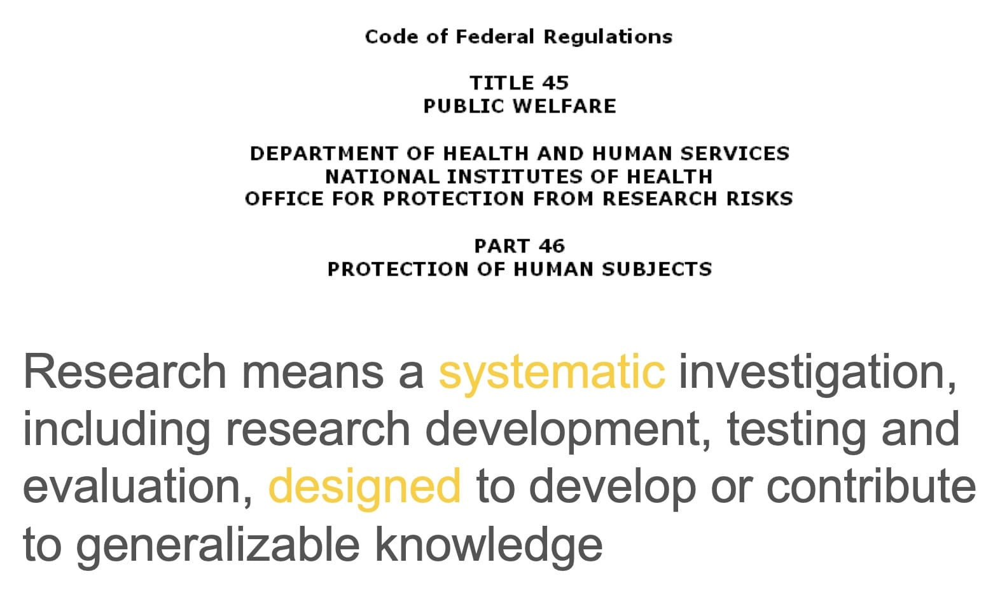
---

class: middle

.big[.blue[Which other activities sometimes share some attributes of research ?]]

- Quality Improvement (Q.I./Q.A.) initiatives

- Public Health Surveillance

* local (e.g., state health departments)
* national (e.g., the CDC)

NOTE: 2019 revision to 45CFR46 excludes Public Health Surveillance activities and Scholarly and Journalistic activities (e.g. oral history) from the definition of research.

---

class: middle

.blue[Let's compare attributes of research and Q.I.]

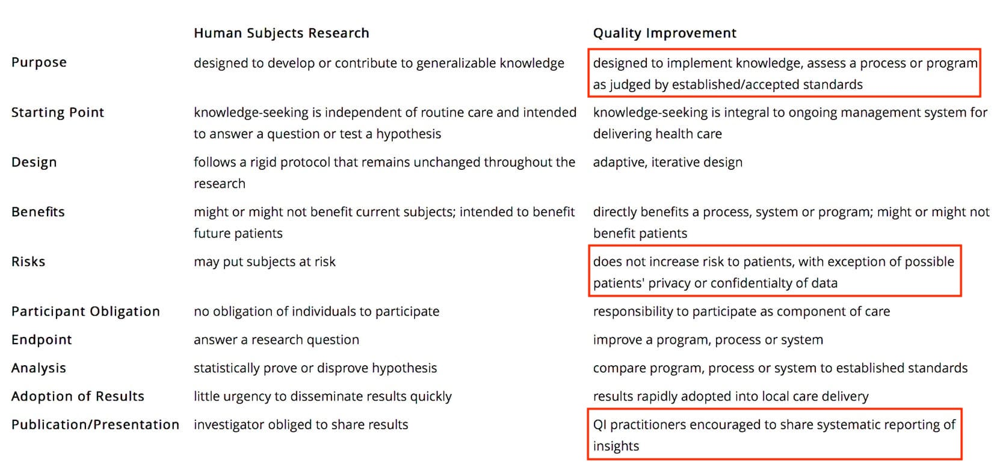

---

class: middle

.bigger[.blue[Distinguishing between research and non-research activities
]]

.big[.grey[The notion of an intent to disseminate (publish) the results of the activity.]

NB: This distinction is nowhere to be found in the 45CFR46]


---

class: middle


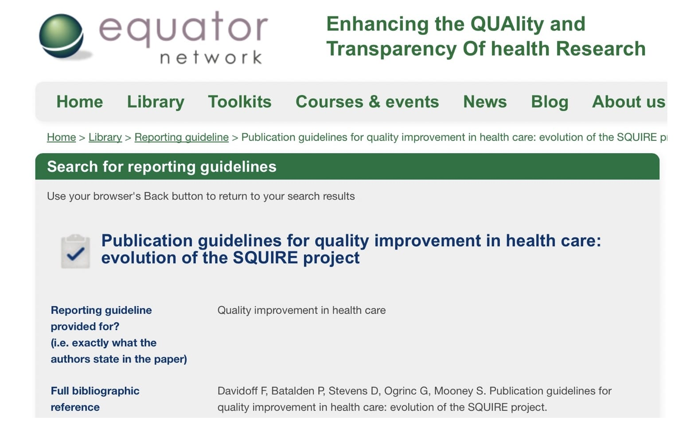
---

class: center, middle

.big[.blue[45CR46 -- Definition of Human Subject]]

.big[Human subject means a living individual .orange[about] whom an investigator (whether professional or student) conducting research:

* Obtains information or biospecimens through .orange[intervention or interaction] with the individual, and uses, studies, or analyzes the information or biospecimens; .red[or]

* Obtains, uses, studies, analyzes, or generates .orange[identifiable private information] or identifiable biospecimens.]

---

class: top, left

<br><br>

.big[.blue[Is this .purple[research] subject to 45CFR46 ? ]

Dr. Jones, a clinical microbiologist and epidemiologist, has been requested to assist in the evaluation of an outbreak of meningitis at a local, community-based assisted- living facility. The result of a CSF culture in the first patient involved shows the presence of a particular species of Streptococcus, not recognized as a typical etiologic agent in meningitis. Dr. Jones recalls that a close friend in the Department of Molecular Genetics at the University is developing a genetic probe for the organism, and may appreciate CSF samples for his research. He calls his friend, who says "Yes, please! I just need about 1-2ml." 

Dr. Jones takes an extra 2ml during the next lumbar puncture(s) and saves it for his friend. He applies a code label to the tube, keeping the code key in a password-protected folder on his laptop.]


---

class: middle

.pull-left[.big[

.orange[Interaction] includes communication or interpersonal contact between investigator and subject.
]]

--

.pull-right[.big[

.orange[Intervention] includes both physical procedures by which information or biospecimens are gathered (e.g., venipuncture) and manipulations of the subject or the subject’s environment that are performed for research purposes.

]]

---

class: middle

.big[The notions of .orange[private] and .orange[identifiable] information.]

.pull-left[.orange[Private] information includes information about behavior that occurs in a context in which an individual can reasonably expect that no observation or recording is taking place, 

and information which has been provided for specific purposes by an individual and which the individual can reasonably expect will not be made public (for example, a medical record).]

--

.pull-right[.orange[Identifiable] private information is private information for which the identity of the subject is or may readily be ascertained by the investigator or associated with the information.

An .orange[identifiable] biospecimen is a biospecimen for which the identity of the subject is or may readily be ascertained by the investigator or associated with the biospecimen.]

---

class: middle

.big[.blue[The possibility of “secondary” subjects of research
]]


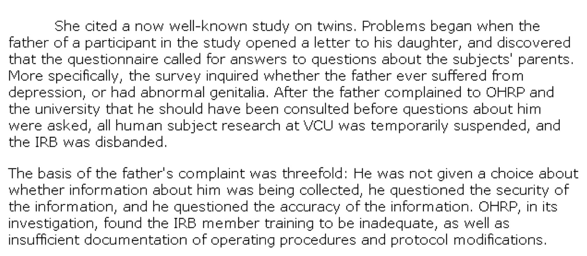

---

class: middle

.big[.blue[This is useful guidance:]]

.pull-left[

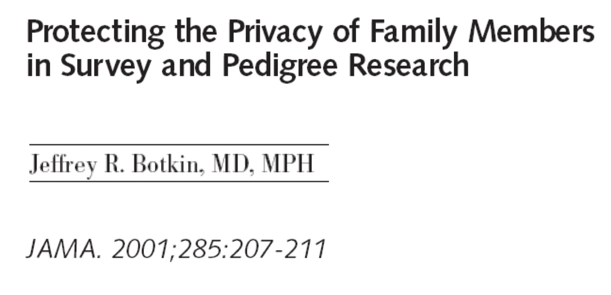

]

.pull-right[

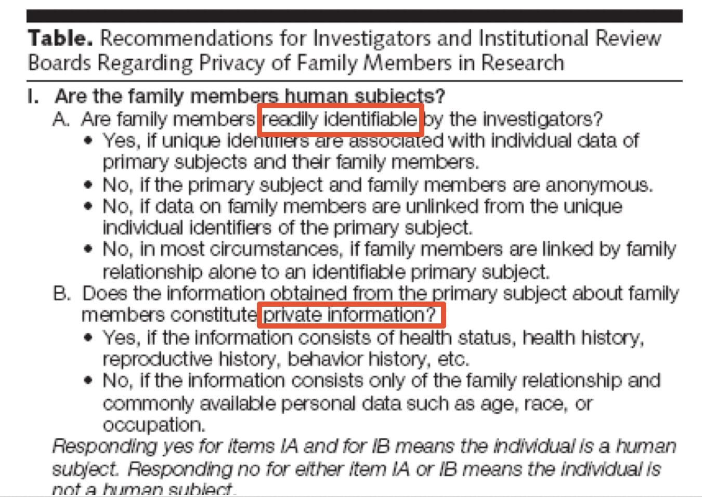

]

---
class: middle

.big[.blue[The possibility of a determination that you are .purple[ *not*] performing .purple[*human subjects*] research -- when using coded information]]

First, the notion of .purple[Secondary Research]

<hr>

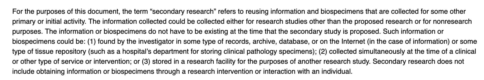
<hr>

.small[Source: https://www.hhs.gov/ohrp/coded-private-information-or-biospecimens-used-research.html]

---
class: top, left

<br><br>

.big[Dr. Jones, a clinical microbiologist and epidemiologist, has been requested to assist in the evaluation of an outbreak of meningitis at a local, community-based assisted- living facility. The result of a CSF culture in the first patient involved shows the presence of a particular species of Streptococcus, not recognized as a typical etiologic agent in meningitis. Dr. Jones later recalls that a close friend in the Department of Molecular Genetics at the University is developing a genetic probe for the organism, and may appreciate CSF samples for his research. He knows that he didn't submit all the removed CSF for examination and culture in all instances and has saved the tubes in his lab.

He calls his friend, who says "Yes, please! I just need about 3ml. But keep a code on each tube in case I need to ask you later for some demographic, or other clinical information, if I find something publishable." 

He later gives the unused lots to his friend.]


---
class: middle

.big[.blue[The possibility of a determination that you are .purple[ *not*] performing .purple[*human subjects*] research -- when using coded data]]

Second, the notion of .purple[not having access to the key code]


<hr>

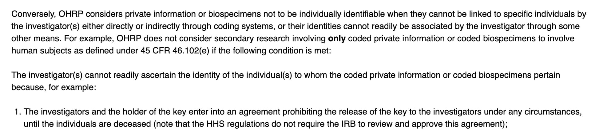

<hr>

.small[Source: https://www.hhs.gov/ohrp/coded-private-information-or-biospecimens-used-research.html]

---


class: middle

.small[.blue[Discussion scenario for Session 4, part I.

Excerpt from : Pronovost et al. NEJM 2006 355:2725-2732]]

.pull-left[.small[.purple[An intervention conducted in ICUs of participating hospitals]

Catheter-related bloodstream infections occurring in the intensive care unit (ICU) are common, costly, and potentially lethal.  The study intervention targeted clinicians' use of five evidence-based procedures recommended by the CDC and identified as having the greatest effect on the rate of catheter-related bloodstream infection and the lowest barriers to implementation. The recommended procedures are hand washing, using full-barrier precautions during the insertion of central venous catheters, cleaning the skin with chlorhexidine, avoiding the femoral site if possible, and removing unnecessary catheters.

Clinicians were educated about practices to control infection and harm resulting from catheter-related bloodstream infections, a central-line cart with necessary supplies was created, a checklist was used to ensure adherence to infection-control practices, providers were stopped (in nonemergency situations) if these practices were not being followed, the removal of catheters was discussed at daily rounds, and the teams received feedback regarding the number and rates of catheter-related bloodstream infection at monthly and quarterly meetings, respectively.

]]

.pull-right[.small[


Throughout the study, data on the number of catheter-related bloodstream infections and catheter-days were collected monthly from a trained, hospital-based infection-control practitioner. To coincide with the implementation periods for the study intervention, monthly data were aggregated into 3-month periods (quarters). The quarterly rate of infection was calculated as the number of infections per 1000 catheter-days for each 3-month period.]

.small[.blue[Questions


* Is this activity research ?
* If this is not research, what should one call it ? Does this even matter ?
* If this is research, are there human subjects ? If so, who are they ?
* Are there any unique (different from the requirements for the ethical conduct of clinical research) ethical concerns or imperatives underlying this process of hospital-based intervention, data gathering and analysis ?
]]]

---

class: middle

.blue[.bigger[Part II

How Are Harm-Benefit Assessments Made?]

]

---

class: middle


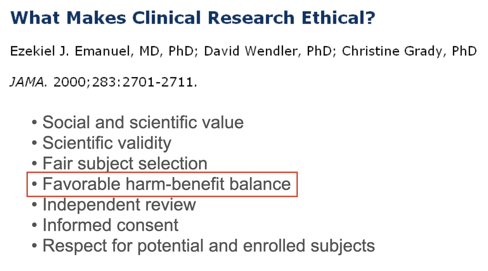
---

class: middle, left

.big[.blue[Potential issues with the usual *risk-benefit ratio*]

* *risk* and *benefit* are asymmetric concepts:

-- risk often implies (directly or indirectly) a probability assertion  
-- benefit inplies a good or valued thing


* as in clinical medicine, potential participants should be told:

-- the nature of the potential benefits and harms  
-- for harms, the nature of it, the likelihood that it will occur; whether it is transient or permanent; whether it may be mitigated if it occurs; the timing of it in relation to the intervention

]

---

class: middle, left

.big[.blue[The use of the *product formula* in assessing the acceptability of potential harms.]]

Risk = magnitude X probability

Consider two scenarios:

--

.pull-left[A medical research protocol employs a liver aspiration for acquisition of tissue, a procedure _not_ ordinarily performed in usual clinical care. Among the potential harms associated with the aspiration is a quoted probability of death of one in a thousand.

This is assessed as a very low risk intervention]

--

.pull-right[In a psychology research protocol, a survey instrument is employed in which questions about sexuality are asked. The quoted possibility of "embarrassment" is stated as ninety percent.


This is also assessed a a very low risk intervention]

--

.purple[For the first scenario, it is asserted that the nature of the harm -- death -- is such that this cannot be judged as a very low risk of harm. Do you agree ?]

---

class: middle, left

.big[.blue[Types of benefits in clinical research]

* In therapeutic research -- a direct medical benefit

* Collateral benefits  -- e.g., extra attention during more frequent research- clinic visits

* Aspirational benefit -- the acquisition of knowledge that will benefit future patients

Don’t confuse benefits with (typically, financial) incentives for participation]

---

class: middle, left

.big[.blue[Misleading notions about incentives]

* Don’t confuse incentives with potential coercion

* The harm- benefit balance must be determined reasonable without regard to incentives for participation

-- we don't pay "danger money" for participation in research that is associated with the possibility of "significant" harm]

---

class: middle, center

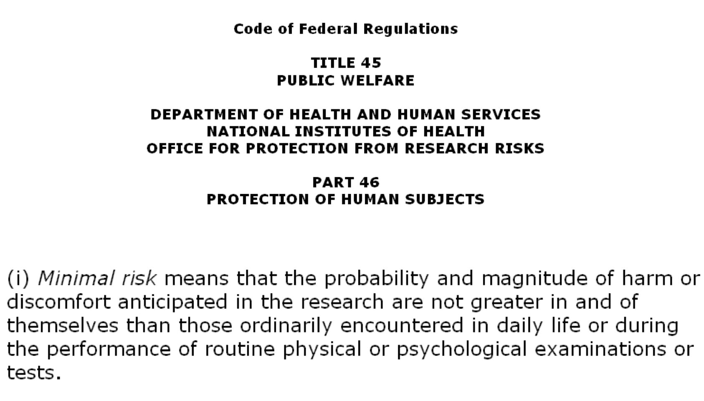

---

class: center, middle

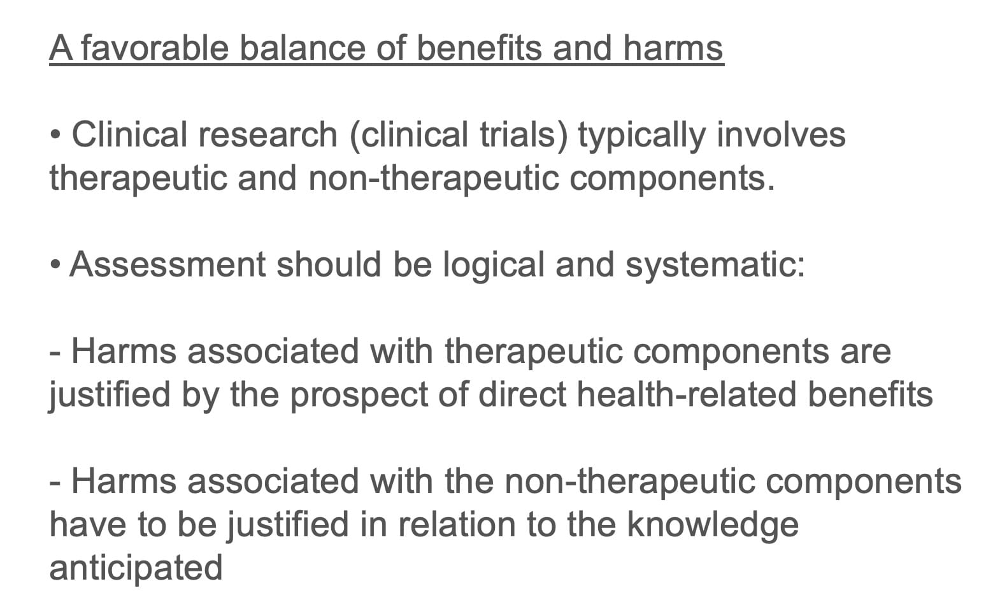

---

class: center, middle

.blue[An example of component-based assessment in a randomized controlled trial]

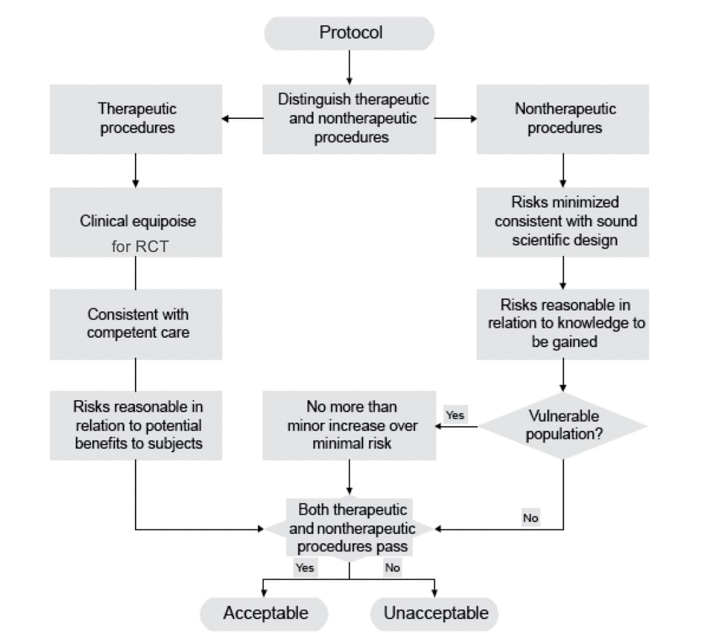

---

class: center, middle

.blue[45CFR46 -- Subpart D. Additional protections for children involved as subjects in research]


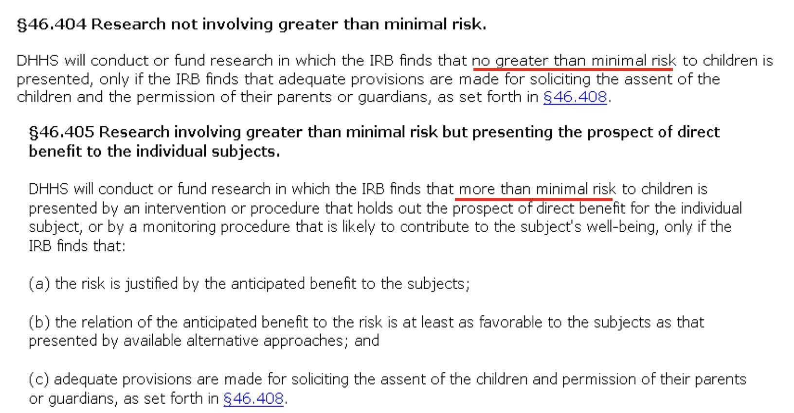
---

class: center, middle

.blue[45CFR46 -- Subpart D. Additional protections for children involved as subjects in research]

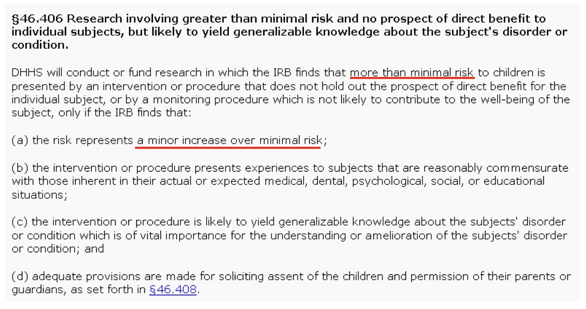
---

class: middle


.pull-left[
.small[.blue[Case Discussion for Part II]]

A researcher proposes to study population differences in insulin sensitivity, resting energy expenditure and body composition in overweight children and non-obese children of overweight parents. He proposes periodic testing and evaluation at five year intervals until the children reach adulthood. Pertinent research procedures and interventions include: acquisition of a medical history and standardized psychological testing; fasting blood tests for a variety of biochemical markers; bone-age X-ray; DEXA scanning for bone density meaurement; oral glucose tolerance test; 24-hour urine collection; measurement of basal metabolic rate by indirect calorimetry; a two-day/one-night admission to a clinical ward for performance of hypergylcemic and hyperinsulinemic challenges that involve placement of IV lines and measurement of serum glucose, free fatty acids and insulin levels; and an MRI of the abdomen to evaluate visceral fat distribution.
]

--

.pull-right[

<br>

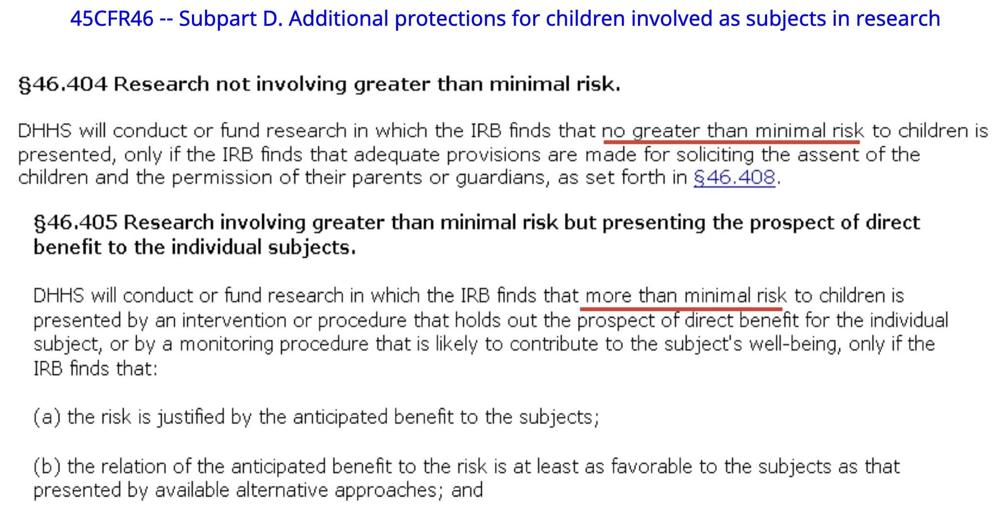

<hr>

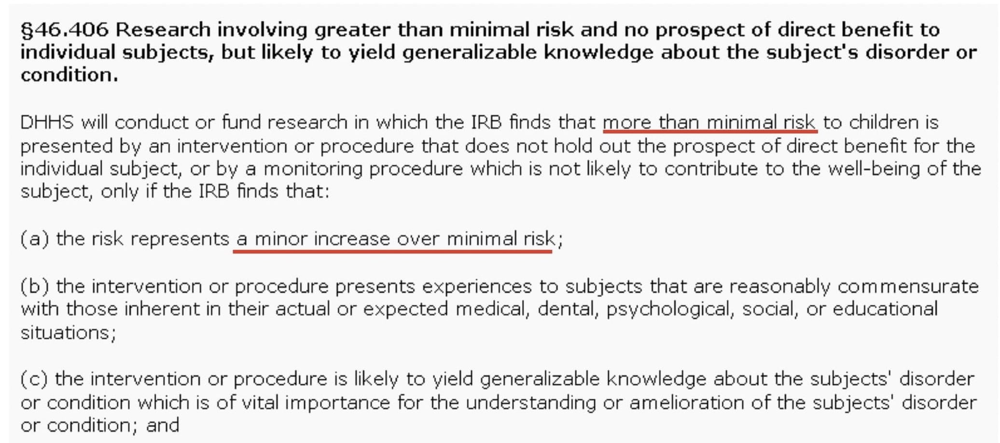

]

---

class: center

<br><br>

.big[Hyperglycemic clamp technique: The plasma glucose concentration is acutely raised to 125 mg/dl above basal levels by a continuous infusion of glucose. This hyperglycemic plateau is maintained by adjustment of a variable glucose infusion, based on the rate of insulin secretion and glucose metabolism. Because the plasma glucose concentration is held constant, the glucose infusion rate is an index of insulin secretion and glucose metabolism. The hyperglycemic clamps are often used to assess insulin secretion capacity.]

<hr>

.big[Hyperinsulinemic-euglycemic clamp technique: The plasma insulin concentration is acutely raised and maintained at 100 μU/ml by a continuous infusion of insulin. Meanwhile, the plasma glucose concentration is held constant at basal levels by a variable glucose infusion. When the steady-state is achieved, the glucose infusion rate equals glucose uptake by all the tissues in the body and is therefore a measure of tissue insulin sensitivity. The hyperinsulinemic clamps are often used to measure insulin resistance.]


```{css echo=FALSE}
.highlight-last-item > ul > li, 
.highlight-last-item > ol > li {
  opacity: 0.2;
}
.highlight-last-item > ul > li:last-of-type,
.highlight-last-item > ol > li:last-of-type {
  opacity: 1;
}
```
